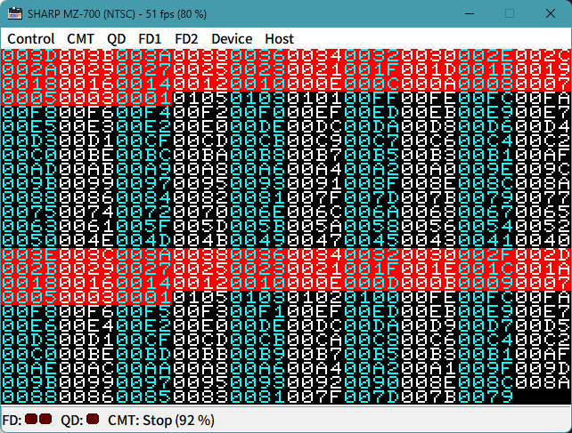
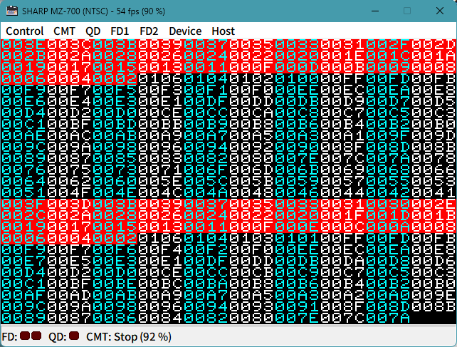

# 8253 Test

- 2025.11 に TAKEDA 氏の EmuZ-700 において, 8253 のカウンタ書き込んだ後に反映されるタイミングを少し変えたとのことで, 動作を確認しています

### 8253 の設定値
```
 +-------------------------------------+
 |  CT1 = 262                        in|<------ 約15.7KHz
 |  モード2 (レート ジェネレーター) out|------+ カウンタ値: 262→1 のくりかえし
 |                                     |      |
 |  CT2 = 0                          in|<-----+ 約60Hz
 |  モード2 (レート ジェネレーター) out|------> カウンタ値: 65535→0 のくりかえし
 +-------------------------------------+
```

### 動作画面の違い
- \VBLKを待った後, 継続的に CT1 値を読みだして 16進16bit で表示してます
- 読みやすいように白とシアンで色付けしています
- 赤いアミカケは /VBLK です

EmuZ-700 2023.05.29


EmuZ-700 2025.12.14 少し遅れてカウントダウンが始まってます



### 気づいたこと
- VRAM に対して LDIR や LDI 命令を実行すると, エミュレータが停止するようです
  CPU が停止し, リセットやデバッガが動かなくなります
  上記2バージョンで確認
  今回のソースは 仮想 VRAM からの転送に LDIR を使ってません