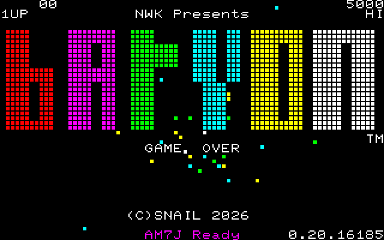
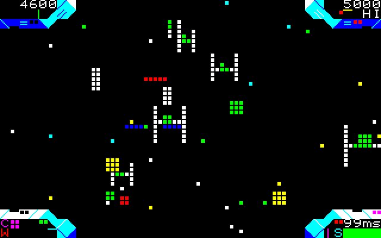
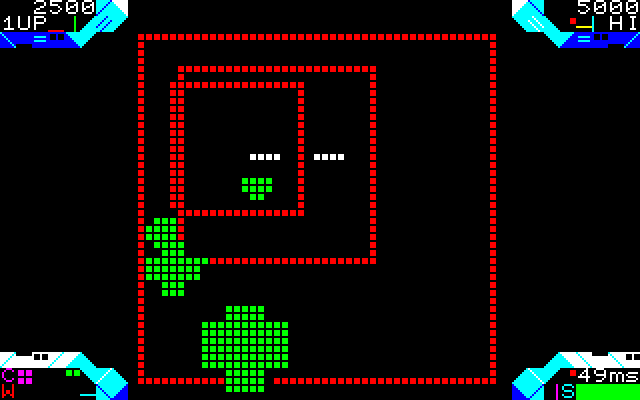
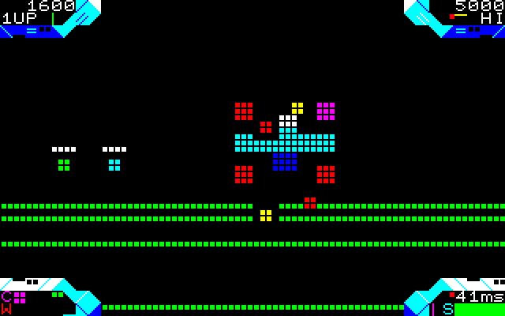
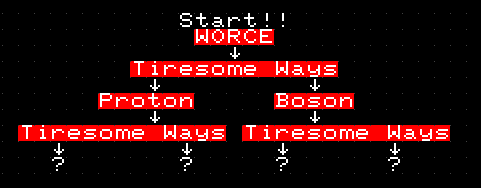
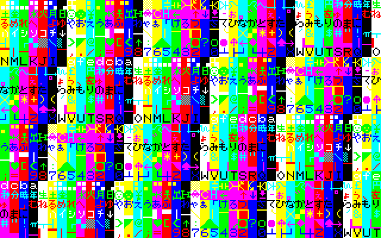
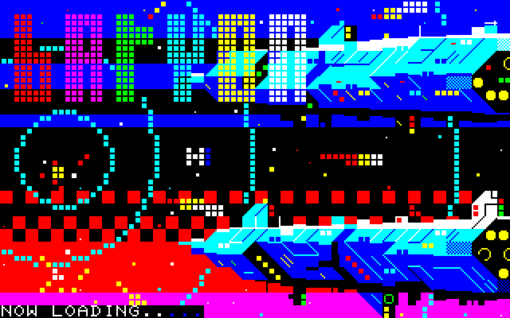

# BARYON リリース ノート Release note

 

- [BARYON リリース ノート Release note](#baryon-リリース-ノート-release-note)
  - [スクショ](#スクショ)
  - [ゲーム概要](#ゲーム概要)
  - [実行環境](#実行環境)
  - [バイナリの場所とロード](#バイナリの場所とロード)
  - [操作](#操作)
  - [パワーアップ](#パワーアップ)
  - [ゲームモード](#ゲームモード)
  - [生き残るために](#生き残るために)
  - [トラブルシューティング](#トラブルシューティング)
  - [制作メモ](#制作メモ)
  - [今後の作業](#今後の作業)
  - [謝辞](#謝辞)
  - [バージョン履歴](#バージョン履歴)

## スクショ

- 序盤戦 
   
- Tiresome Ways 
   
- ボス戦 
   

## ゲーム概要

- MZ-700 では珍しい 3D レール シューター
- とにかく敵を破壊しまくって生き残りましょう!! 
  シールドが無くなるとゲームオーバーです
- 途中で分岐があり、マルチエンディングになってます
  
- プレイ時間は、約10～15分と短めです
- 難易度はそこそこ低めの筈?
- それでは, 良い宇宙の旅を!!

## 実行環境

- エミュレータは, EmuZ-700 のみ確認しています.  
  MZ700Win では多分動作しません 
  MZ-1500 も動きます - リセットしてもゲームは破壊されません. 今のところ, QD には対応してませんが... 
  欧州版 MZ-700 では多分動きません - キャラが異なるし, ビデオ信号に敏感なコードを含む為です
- 今のところ, 対応はテープ版のみ. QD や FDD は今のところ考えてません...

## バイナリの場所とロード

- bin/ にあります. 最新版以外にはファイル名の終わりにバージョンが付きます
  | ファイル名 | ロード時間    | 説明 |
  |------------|---------------|------|
  | baryon.mzt | 約5分         | 64KBのメモリ一杯にプログラムやデータを行き渡らせる為に, 3段ロードになってます このファイルは, 3つの mzt ファイルを連結したものです |
  | baryon.wav | 約4分         | ロード時間の短縮の為, 2段目以降の「インフォメーション ブロック」や「2回目のデータ ブロック」を端折ってます |
- ロード開始後約 40 秒程で, RAM テストを行います 
  (アーケード風の演出で, それなりに真面目にやってますが, あまり意味がない)
   
  F1～F5 のいずれかを押すと, RAM テストはスキップして, 続きをロードします
  
- エントリー ポイントは, 0x1900 です

## 操作

- ジョイスティックは, MZ-1X03 方式と AM7J 方式を自動検出します 
  - MZ-1X03 プロトコルをあまり守ってないジョイスティックの為に, 自動検出を外した 強制 MZ-1X03 モード があります 
   **注意!!** AM7J ジョイスティックを接続した状態で, 強制 MZ-1X03 モードにすると悲しいことが起こります
- 操作
  | キー                 |ジョイスティック | 説明                                           |
  |----------------------|-----------------|------------------------------------------------|
  | WSAD, UMHK, 上下左右 | 上下左右        | 自機 (カーソル) の移動                         |
  | スペース, Z, V       | A ボタン        | ショット                                       |
  | X, J, B              | B ボタン        | クラッシュ (敵の弾が全て消えます)              |
  | F1, F3, F5           |                 | 決定, ポーズ, ゲーム再開等に使用します         |
  | F2, F4               |                 | スキップ, キャンセル等に使用します             |

## パワーアップ

- 時々現れるパワーアップをうまく使って戦いを有利に進めましょう!
  | 種類                                        | 説明                                        |
  |---------------------------------------------|---------------------------------------------|
  |  **S** | シールド回復                                |
  |  **W** | 武器の強化 (貯め打ちができるようになります) |
  |  **C** | クラッシュ + 1                              |
  |  **A** | 敵全滅                                      |

## ゲームモード

-
  |モード  |敵の強さ              |ひとこと                             |
  |--------|----------------------|-------------------------------------|
  |EASY    |弾が少ない            |デモやエンディングはありません       |
  |NORMAL  |普通                  |最初はコレ!                          |
  |HARD    |弾が多い              |ぐるぐる回れば避けられる!?           |
  |AMBIENT |最後に選んだ難易度    |延々と画面を眺めるだけの環境モード デモやエンディングはありません ポーズ/中断以外の操作はできません ハイスコアには反映されません |

## 生き残るために

- 障害物や敵の弾をうまくすりぬけられるように, 宇宙船の大きさ感覚を身を付けましょう
- 解像度が低いので, オブジェクトが集中すると敵の弾が見づらいです.  
  赤と黄の点滅が1ピクセルでも見えたら急いで回避運動しましょう
- クラッシュボタンには常に指を載せておきます

## トラブルシューティング

- ロード中に ABORTED と表示され, 止まっちゃいます! 
  → ロード中に BREAK キーなどを押されて中止されました 
  リセットして最初からやり直してください
- ロード中に CHECK SUM ERROR と表示され, 止まっちゃいます! 
  → ロードしたデータが正しくありません.  
  リセットして最初からやり直してください
- ロード中に LOAD FAILED と表示され, 止まっちゃいます! 
  → 1段目ロードが失敗したまま2段目以降をロードしようとしました 
  リセットして最初からやり直してください
- うっかりリセットしちゃった! 最初からロードしなければいけないの? 
  → モニターから「G1900」とタイプしてください! (但しハイスコアなどは消えてしまいます)

## 制作メモ

- 制作期間は, 2023.01～ 
  1年ほど何もやってない期間もあります
- 最初は C で実験コードを書いてましたが, 遅いのでインライン アセンブラ化したところ,
  速度が出たので本格制作をスタート. 結果的に 90%以上がアセンブラ化されました
- OLION のような一定時間に敵を探索して倒すゲームを作ってましたが, 途中からレール シューターに化けました 
  ZAT MZ-700 3D シューティングの集大成を目指してます
- アセンブラで書くのが億劫なので, 代数/構造化アセンブラを開発しました
- 音源は, PFM 方式による 6 重和音です
- 奥行の座標は, 256 しかありません! これを 16 段階のオーダリングテーブルで表示優先処理を行ってます
- ワームホール シーンは古の「疑似3Dレースゲームのカーブ生成アルゴリズム」です
- ラインや円は, Bresenham アルゴリズムです. クリッピング処理は結構苦労しました
- 解像度が低いので, オブジェクトが増えると見づらくなってしまいます(苦笑) 
  一部の図形には輪郭を出すように処理を入れました. 少しは見やすくなったでしょうか

## 今後の作業

  - バグとり
  - ゲームバランス等
  - ステージ・メニューを増やす
  - メモリを整理して容量を増やす(1-2KBくらい増えるはず)
  - 呼び出し規約に sdcccall(1) を採用(プログラムの高速化と1KBくらいのメモリ削減を期待. めんどうくさい...)

## 謝辞

  - Uranus - いつもいつもありがとう
  - ひゃあ。えふ。世界観のベース
  - Y.SD - Tiresome Ways をパクッてすまん
  - Shin - 亜空間ファイト をパクッてすまん

## バージョン履歴

* 2026.12.xx 0.2 α版: 最初のリリース 
  だいたいの仕様は入れました 
  ステージはまだ少しだけ