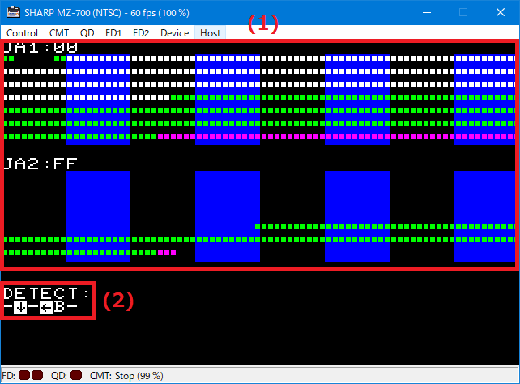

# Joystick MZ-1X03 test

シャープ純正アナログ ジョイスティック MZ-1X03 の動作テスト プログラムです. 生データの表示とジョイスティックの検出を行います. 
This is a program to test the operation of the genuine Sharp analog joystick MZ-1X03. Displays raw data and detects joystick.

## つかいかた / How to use

- (1)... /VBLK 以降の JA1/JA2 の生データを 560 個表示します. 値が '1' ならばドットを表示します. 1 dot = 28 T states です.
        白い部分が判定に有効な範囲, マゼンタの部分は /VBLK 外になります(NTSC のみ) 
        Displays 560 JA1/JA2 raw data after /VBLK. If the value is '1', a dot is displayed. 1 dot = 28 T states.
        White area is valid range for judgment, magenta area is outside of /VBLK (NTSC only).
- (2)... シンプルなジョイスティック判定です. 方向とボタンを表示します. ジョイスティックが検出できなかった場合は 'XXXXXX' と表示します. 
        This is a simple joystick detection. Display the direction and button. If the joystick is not detected, display 'XXXXXX'.

## 信号の詳細 / Signal Details

- MZ-1X03 の軸は, /VBLK の立下がり後, 少しの遅延の後に '0' になり, ((10 + n) * 28) T states 後に '1' (n=0～255) になるようです. 
  The axis of MZ-1X03 seems to be '0' after a short delay after the falling edge of /VBLK, and '1' after ((10 + n) * 28) T states (n=0-255).
- 本プログラムは, /VBLK の立下がり後, 約 150 T states 後に '1' を検出したら非接続と判定します. 
  This program judges the connection to be disconnected when it detects '1' about 150 T states after the falling edge of /VBLK. 
