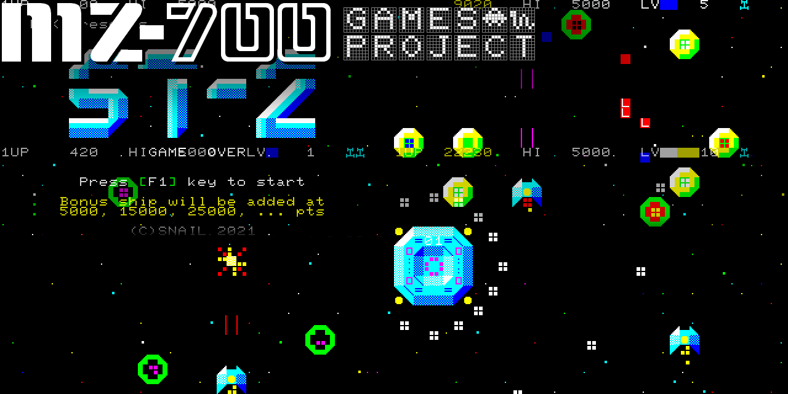

# MZ-700 Game Projects



* ある日唐突に MZ-700 で動くゲームを作ってみたくなったので, 作りました！<br>
  One day I suddenly wanted to make a game that runs on the MZ-700.
  Nowadays, there are Z80 cross-compilers and emulators. So I made it.
* 実行可能バイナリ (.mzt) は残してるので, ビルドしないで遊ぶことができます<br>
  I'm leaving the executable binaries (.mzt) so you can play without building.
* EmuZ-700 エミュレータでしか動作確認してませんが, 多分実機でも動く...かな?<br>
  I confirmed the operation only with the EmuZ-700 emulator. But I think it will work on the actual machine...maybe...
* PCG-700 等の外付け PCG ハードウェアを使用している場合は, 無効化してください.<br>
  HAL 研究所の製品ならば, GSW スイッチを OFF にします. 互換ハードウェアの場合, 取説に従ってください<br>
  If you are using third party PCG hardware(eg. HAL Lab. PCG-700), please disable it.<br>
  For HAL Laboratory products, turn off the GSW switch. For compatible hardware, follow the instructions.
* MZ-1R12(SRAM メモリ カード), MZ-1E05(FDD I/F), MZ-1E14(QD I/F) を装着している場合, 起動しない場合があります. <br>
  原因は不明です. その場合は, これらを切り離してください.
  If MZ-1R12 (SRAM memory card), MZ-1E05 (FDD I/F), MZ-1E14 (QD I/F) is installed, it may not start.<br>
  The cause is unknown. In that case, disconnect them.
* MZ-1500 の場合, リセットすると動かなくなるプログラムがあるかもしれません. その場合はロードし直してください.<br>
  For the MZ-1500, some programs may stop working after resetting. Please reload.
* MZ-700 に不可能はない! "MZ-700 has NO LIMIT!"


# Features

* 複数のサブ プロジェクトが中に入ってます
* **Test** <br>
  コンパイラの動作テスト. makefile はありません. バッチファイルで作ります<br>
  Compiler operation test. There is no makefile, build it with a batch file
* **Memory Dirtinizer** <br>
  実機の電源投入時のように, メモリを「汚く」して, リセットします. makefile はありません. バッチファイルで作ります.<br>
  Like when the power of the actual machine is turned on, it "dirts" the memory and resets it. There is no makefile. Make it with a batch file.<br>
* **JoystickMZ1X03Test** <br>
  シャープ純正ジョイスティック MZ-1X03 の動作テスト (デジタル, 検出機能付き) <br>
  Operation test of genuine Sharp joystick MZ-1X03 (digital, with detection function)
* **SoundTest** <br>
  サウンド テスト (3音源, OR合成) <br>
  https://www.youtube.com/watch?v=Qs5GZ-hzjp4
* **SoundTest2** <br>
  サウンド テスト2 (3音源, OR合成, 波形誤差拡散)
* **SoundTest3** <br>
  サウンド テスト3 (6音源, OR合成)
* **SoundTest3** <br>
  サウンド テスト4 (4音源, PWM)
* **ST-2** <br>
  習作 縦シューティングゲーム.<br>
  https://www.youtube.com/watch?v=PG0ijYIvdNw
* 以後, 妻が許せばゲームを増やす予定<br>
  I'm planning to increase the number of games, if my wife allows it.

# Requirement

* バイナリを用意しています. 遊ぶだけなら, 必要なのはエミュレータ(or 実機)のみです
  Binaries are available. If you just want to play, you only need the emulator or the actual machine.
* **EmuZ-700** http://takeda-toshiya.my.coocan.jp/common/index.html<br>
  代表的な MZ-700 エミュレータ.<br>
  モニター ROM イメージと日本版フォントイメージが必要です.<br>
  互換イメージが入手できます<br>
  A typical MZ-700 emulator. <br>
  Needs MZ-700 monitor ROM image and Japanese font image.<br>
  Compatible images are available here: http://mzakd.cool.coocan.jp/starthp/mz700win.html
* Windows 10 + Power Shell 7
* **z88dk** https://github.com/z88dk/z88dk/wiki <br>
  nightly build 20241022
* **php 8.x** https://windows.php.net/ <br>
  gd と mbstring を有効化してください.<br>
  I'm using gd and mbstring, so enable it.
* **gmake 3.81 for Windows** http://gnuwin32.sourceforge.net/packages/make.htm
* **exomizer 3.1.1** https://bitbucket.org/magli143/exomizer/wiki/Home<br>
  圧縮ツール. ANSI-C コンパイラでビルドして tools/ に置いてください.<br>
  Compressor. Needs ANSI-C compiler. Build exomizer.exe and put in tools/.
* **salvador** https://github.com/emmanuel-marty/salvador<br>
  高速 ZX0 圧縮ツール. Visual Studio 等でビルドして tools/ に置いてください.<br>
  Fast ZX0 compressor. Build with Visual Studio or similar and put in tools/.

# Build

* ビルドはプロジェクト ルートで<br>
  Build at the project root:
```
>make
```
* 又は, 各サブ プロジェクト フォルダへ移動して<br>
  Or, in each subproject folder:
```
>cd SoundTest
>make
```
* それぞれ, make clean や meke release が用意されてます<br>
  'make clean' and 'meke release' are available respectively.

# EmuZ-700 あんちょこ Cheat Sheet

* エミュレータのおすすめ設定 Recommended emulator settings
  * Uncheck [Device]->[Sound]->[Play CMT Noise]
  * Uncheck [Device]->[Sound]->[Play CMT Sound]
  * Check [Device]->[Joystick]->[AM7J Adapter]
  * Use XInput Joystick.
* MZT ファイルのロードと実行 How to load and run the MZT program
  1. Reset once the CPU [Control]->[Reset]
  2. Set the MZT file [CMT]->[Play]
  3. Type 'L[CR]' on the monitor. The program is automatically loaded and executed.

# Author

* SnailBarbarianMacho

# License

* This project is under [MIT license]<br>
  except <br>
  - deexo3.c (original by uniabis) is under [zlib license]
  - dezx0.c (original by Einar Saukas & Urusergi) is under [BSD 3-Clause License]
* このプロジェクトの成果物のスクリーンショットや動画は, 私の承諾なしに, 自由に作成して配布できます<br>
  でも出会ったらビールを奢ってください<br>
  Screenshots and videos of the deliverables of this project can be freely created and distributed without my consent.<br>
  But if you meet me, please buy me a beer.

# Thanks to

* MZ-700 ハードウェア資料を提供し, 様々なテクニックを考案し, EGC7 を作ってくれた 紅茶羊羹氏<br>
  KochaYokan, who provided the MZ-700 hardware materials, devise various techniques, and created EGC7.
* Exomizer を作ってくれた Magnus Lind 氏らと, その depacker を作ってくれた uniabis 氏<br>
  Magnus Lind and others who made the Exomizer and uniabis who made the depacker
* ZX0 を作ってくれた Einar Saukas 氏と, 圧縮ツール salvador を作ってくれた Emmanuel Marty 氏<br>
  Einar Saukas, creator of ZX0, and Emmanuel Marty, creator of the compression tool salvador
* 再現性の高いエミュレータ EmuZ-700 を作ってくれた TAKEDA, toshiya 氏<br>
  Mr. TAKEDA, toshiya who made the highly reproducible emulator EmuZ-700
