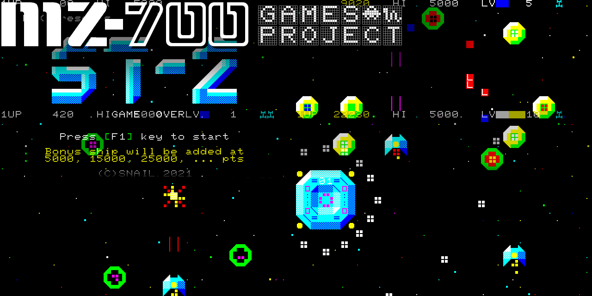

# MZ-700 Game Projects

(Recently, the quality of machine translation has improved, so I decided not to write the English translation...)



* ある日唐突に MZ-700 で動くゲームを作ってみたくなったので, 作りました！
* 実行可能バイナリ (.mzt) は残してるので, ビルドしないで遊ぶことができます
* EmuZ-700 エミュレータでしか動作確認してませんが, 多分実機でも動く...はず
* PCG-700 等の外付け PCG ハードウェアを使用している場合は, 無効化してください.<br>
  HAL 研究所の製品ならば, GSW スイッチを OFF にします. 互換ハードウェアの場合, 取説に従ってください
* MZ-1R12(SRAM メモリ カード), MZ-1E05(FDD I/F), MZ-1E14(QD I/F) を装着している場合, 起動しない場合があります. <br>
  原因は不明です. その場合は, これらを切り離してください.
* MZ-1500 の場合, リセットすると動かなくなるプログラムがあるかもしれません(モニターROMがワークを破壊する為). その場合はロードし直してください.<br>
* MZ-700 に不可能はない! "MZ-700 has NO LIMIT!"


# Features

* 複数のサブ プロジェクトが中に入ってます
* **test** <br>
  コンパイラの動作テスト
* **memory-dirtinizer** <br>
  実機の電源投入時のように, メモリを「汚く」して, リセットします
* **ram-check** <br>
  RAM と VRAM をチェックします
* **joystick-mz1x03-test** <br>
  シャープ純正ジョイスティック MZ-1X03 の動作テスト (デジタル, 検出機能付き)
* **8253-test** <br>
  8253の動作を理解するための実験コード (適時書き換えられます)
* **sound-test1** <br>
  サウンド テスト1 (3音源, OR合成)
  https://www.youtube.com/watch?v=Qs5GZ-hzjp4
* **sound-test2** <br>
  サウンド テスト2 (3音源, OR合成, 波形誤差拡散)
* **sound-test3** <br>
  サウンド テスト3 (6音源, OR合成)
* **sound-test4** <br>
  サウンド テスト4 (4音源, PWM)
* **ST-2** <br>
  習作 縦シューティングゲーム.<br>
  https://www.youtube.com/watch?v=PG0ijYIvdNw
* 以後, 妻が許せばゲームを増やす予定<br>

# Requirement

* バイナリを用意しています. 遊ぶだけなら, 必要なのはエミュレータ (または 実機) のみです
* **EmuZ-700** http://takeda-toshiya.my.coocan.jp/common/index.html<br>
  代表的な MZ-700 エミュレータ.<br>
  モニター ROM イメージと日本版フォントイメージが必要です.<br>
  互換イメージが入手できます: http://mzakd.cool.coocan.jp/starthp/mz700win.html
* Windows 10 + Power Shell 7 以上
* **z88dk** https://github.com/z88dk/z88dk/wiki <br>
  nightly build 20241022<br>
  環境変数 PATH を通してください
* **php 8.x** https://windows.php.net/ <br>
  gd と mbstring を有効化してください <br>
  環境変数 PATH を通してください
* **gmake 4.4** <br>
  Mingw-w64 から入手します https://www.mingw-w64.org/ <br>
  bin/mingnu32_make.exe を make.exe にリネームして, これ以外は削除します.<br>
  環境変数 PATH を通してください
* **exomizer 3.1.1** https://bitbucket.org/magli143/exomizer/wiki/Home<br>
  圧縮ツール. ビルドして完成した exomizer.exe を tools/ に置いてください
* **ZX0** https://github.com/einar-saukas/ZX0<br>
  圧縮ツール. zx0.exe を tools/ に置いてください
* **salvador** https://github.com/emmanuel-marty/salvador<br>
  圧縮ツール. ビルドして完成した salvador.exe を tools/ に置いてください

# Build

* ビルドはプロジェクト ルートで<br>
```
>make
```
* 又は, 各サブ プロジェクト フォルダへ移動して<br>
```
>cd サブプロジェクトフォルダ
>make
```
* ゲームの場合は make だけだとデバッグ バージョンを作ってしまいます. 本番バージョンは次のようにします:
```
>cd ゲームサブプロジェクトフォルダ
>make release
```

* それぞれ, make clean や meke release が用意されてます<br>

# EmuZ-700 あんちょこ Cheat Sheet

* エミュレータのおすすめ設定
  * [Device]->[Sound]->[Play CMT Noise] のチェックを外す
  * [Device]->[Sound]->[Play CMT Sound] のチェックを外す
    * これらの設定にすると, エミュレータは, カセットのモーターが回っている間はフルスピードでエミュレーションを実行するので, 速く読み込みます
  * [Device]->[Joystick]->[AM7J Adapter] を選択
  * XInput に対応した Joystick を使用してください
* MZT ファイルのロードと実行
  1. [Control]->[Reset] でリセットします
  2. MZT または WAV ファイルをセットします [CMT]->[Play]
  3. エミュレータのモニター上で 'L[CR]' をタイプします

# History

* 2021.10.09 ST-2, sound-test1 公開
* 2021.10.20 memory-dirtinizer 公開
* 2022.05.21 sound-test2 公開
* 2022.09.28 joystick-mz1x03-test 公開
* 2024.09.14 sd6 公開
* 2024.09.14 sd4 公開
* 2025.09.08 ram-check 公開
* 2026.01.03 8253-test 公開

# Author

* SnailBarbarianMacho (NWK)

# License

* This project is under [MIT license]<br>
  except <br>
  - deexo3.c (original by uniabis) is under [zlib license]
  - dezx0.c (original by Einar Saukas & Urusergi) is under [BSD 3-Clause License]
* このプロジェクトの成果物のスクリーンショットや動画は, 私の承諾なしに, 自由に作成・改変して配布できます<br>
  でも出会ったらビールを奢ってください

# Thanks to

* MZ-700 ハードウェア資料を提供し, 様々なテクニックを考案し, EGC7 を作ってくれた 紅茶羊羹氏
* Exomizer を作ってくれた Magnus Lind 氏らと, その depacker を作ってくれた uniabis 氏
* ZX0 を作ってくれた Einar Saukas 氏と, 圧縮ツール salvador を作ってくれた Emmanuel Marty 氏
* 再現性の高いエミュレータ EmuZ-700 を作ってくれた TAKEDA, toshiya 氏
