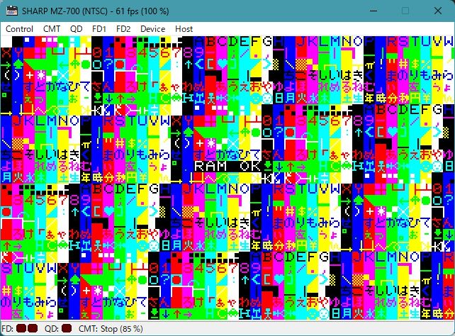

# RAM チェック / RAM check

* MZ-700 の プログラム以外の全 RAM (VRAM を含む) をテストします
* メモリそのもの異常の他, アドレスバス, データバスの異常 (配線のショートや切断) も検出できると思います
* 結果表示とコード部分以外の RAM は使用してません (スタックや変数はありません)
* コードは, 自己書換してません
* テスト時間は, 約10秒. 正常なら「RAM OK」を, 異常なら「RAM BAD アドレス」を画面中央に表示して HALT します
* システムがすこぶる不安定の場合, チェック中に暴走して結果を表示しない場合があります. 電源を疑ってみてください
* このテストを通っても, システムが正常とは限りません. 参考程度にお使いください
* ビルドは build.bat で行います