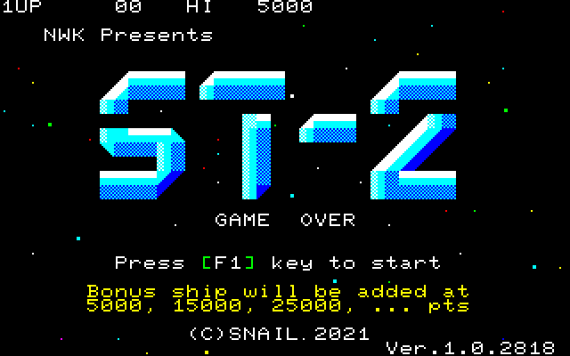
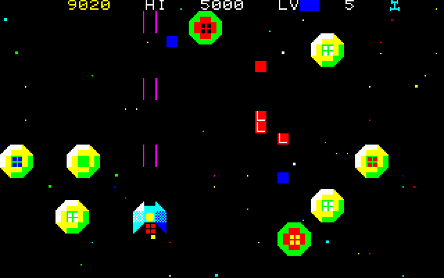
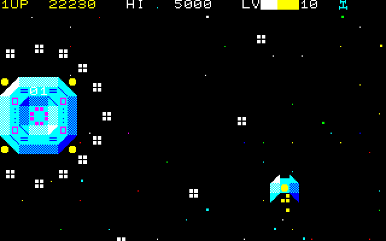

# ST-2 リリース ノート Release note

## ゲーム概要
  - 習作シューティング ゲーム. 全 19 ステージ でエンディングです 
 - ラスボスは非常に硬いです **(Lv1弾30000発以上の耐久力!)**. 敵をやっつけたら現れる 'L' アイテムをどんどん取って, レベル アップしてください!
  - キー
    - **WSAD, UMHK, 上下左右** ... 自機の移動
    - **スペース, Z, V** ... ショット
    - **F1, F3** ... 決定, ポーズ, ゲーム再開, スキップに使用します
    - **F2, F4** ... スキップ, キャンセルに使用します
  - ジョイスティックは, MZ-1X03 方式と AM7J 方式を自動検出します. 
    - MZ-1X03 プロトコルをあまり守ってないジョイスティックの為に, 自動検出を外した **強制 MZ-1X03 モード** があります. 
     **注意!!** AM7J ジョイスティックを接続した状態で, 強制 MZ-1X03 モードにすると悲しいことが起こります
  - 敵をなぎ倒す快感を追求し, 連射度は高めにしました
  - ノーミスでも, コンティニューしまくっても, エンディングは同じです. 昔ほど意地悪しなくなりました
  - 制作期間は, 2021.07～11. 
    緊急事態宣言で, 夏休みも遠出できないので, 引きこもって作りました
  - ゲーム本体のエントリー ポイントは, 0x1e00 です

## ゲームモード(ver.1.10 以降)

  - どのモードでも, ハイスコアは共用で, エンディングは同じです(手抜き)

|モード  |開始レベル|敵の強さ              |自機の数                   |自機ミスで レベルダウン|ひとこと|
|--------|----------|----------------------|---------------------------|--------------------------|--------|
|EASY    |LV50      |普通                  |3機スタート, 得点で増加 |なし      |楽々エンディング        |
|NORMAL  |LV1       |普通                  |3機スタート, 得点で増加 |なし      |最初はコレ!             |
|HARD    |LV1       |強い (アイテム多め)|3機スタート, 得点で増加 |10%ダウン |ムズイ...               |
|SURVIVAL|LV1       |強い (アイテム多め)|1機スタート, 増加なし   |-         |1機でどこまでいけるか!  |
|CARAVAN |LV1       |強い (アイテム多め)|無制限 (無敵時間短め)   |なし      |300秒制限, 専用ステージ,レベルアップ速い |

## テクニックなど

* プレーヤーの衝突判定は中央の 1 キャラしかないので, サイド アタックができます 
  耐久力の高い敵に対しては注意してください
* 出来るだけ効率良くアイテムを取るには
  - 左右端では倒さない! アイテムが画面外に出てしまうことがあります
  - アイテムは一度に 32 個迄しか管理しないので, 沢山表示してると敵を倒しても出なくなります. できるだけ早く回収しましょう

## EmuZ-700 + 互換 JP-ROM でしか動作確認してませんが, 皆様のご協力で実機(日本版)での確認が進んでます

  - ロード後, ゲームは起動しますか?(△) 
    起動しない人がいるようです. 
    起動しない場合は, ST-2-debug.mzt(デバッグ版) や, game/Game.mzt(非圧縮版) で試してください
  - 速度は遅くなったり速くなったりしてませんか?(〇: 動画を見てる限り, 問題なさそう)
  - 三重和音の音色は綺麗に出てます?(〇: 動画を見てる限り, 音色もほぼ同じ)
  - NWK ロゴは正しく表示されてます?(〇: 2回のバージョンアップを経て正しく表示するようになりました) 
  - ジョイスティックは反応しますか?(〇: 左右同時押しでポーズがかかるので, 1.01 では TOWNS PAD対応は廃止)
  - EU 版の MZ-700 は, CPUクロック, CG-ROM 及びビデオ信号規格(PAL) の違いなどから:
    - 表示がおかしくなります(背景の星など)
    - 三重和音の音程はやや低くなります.
    - キー マトリクスは恐らく同じなので, 何とか遊べると推測しています.
    - ジョイスティックは動かないかもしれません

## 作ってみての感想など

  - 最初はシンプルなシューティングのつもりでしたが, 作ってるうちに仕様が変わっていきました.
    - 敵の種類が増え,
    - レベル アップの概念がついて,
    - 弾幕系になったりして
  - SE は作るのは楽しかったです. 曲は専用 MML で作らなければならないので, MIDI -> MML コンバータを作りました
  - 思ったより速度が出ててたので, 今後のゲーム制作にも期待できそうです
  - 見ての予想通り, スコアは 655360 点で, レベルは 255 でカンストします :-)
  - レベルがやたらと上るのは, グローディア系 RPG の影響
  - エンディングの統計表示は, ブランディッシュの影響w
  - アイテムは, 最初は, カクカク動くものでした. 
    動きが目ざわりだったので, キャラクタの組み合わせで滑らかに動くようにしました. 
    'L' の文字は 4 フレームに 1 回しか表示できませんが, 逆に良い効果になりました
  - 乱数が多いので, ゲーム性に難があります. 次回作は乱数を減らしたいです
  - 実機で確認する人が世界中に居て驚いた

## 技術的な話

* 1980 年代に確立された古典的ビデオゲームの技術を導入した MZ-700 のゲームは少ないです
  - なので, C 言語でこれらの技術を導入した場合のパフォーマンスを確かめるために作りました
  - 1980-2000 年に渡って開発された MZ-700 のテクニックをふんだんに盛り込んでみました
* コンバーターやデータ作成等の類は全部 PHP で作成しました.
  - 依存リスト作成も gcc は使わずに PHP で書いてます
* MZ-700 は VRAM アクセスに大きなウエイトがかかるので, 仮想 VRAM から転送するようにしました
  - 仮想 VRAM から VRAM への転送は H-BLANK 中に行います. 1/60 秒かかってますが, それでも直接 VRAM に描くより速いです
  - 実際は 2/60 ～ 4/60 sec で動作してます
  - 仮想 VRAM は上下左右にマージンを持たせてるので, オブジェクトの多少のはみ出しを許容してます. でも固定画面ゲームだと関係ないですよね.
  - というわけでタイトルロゴだけ右から出てくるようにしてみました
* C コンパイラは, 色々悩みましたが, Z88DK(SDCC) を採用しました
  - 余り高速なコードは吐きませんが(それでも 1980年代のコンパイラより速い), ライブラリが高速なのがウリで, 各 8bit パソコン用バイナリを作ってくれます
  - 何故か 2 種類のコンパイラ(SCCZ80, SDCC) が同梱されてて好みで選べます.  
    コードが小さくなる前者, 速度の後者といった感じです
  - crt0 は試行錯誤で余計な機能を削り, static 変数の初期化まで削りました
* 高速化テクニックなど
  - 重たい処理, タイミングが必要な処理はインライン アセンブラで書かれてます
    - 描画, 衝突判定, 背景の星, 仮想 VRAM 転送, 三重和音, 数学関数, 16->10進変換, ジョイスティック等...
    - sin, cos, atan はテーブル検索方式で, 256 バイト境界に配置し, 低精度・高速です
    - 乱数は M 系列疑似乱数で, 線形合同法より高速です
  - C で書く場合も, 計算はできるだけ 8bit で行い, 乗除算は殆ど使ってません
* 通常は 64KB フル RAM で動作します
  - モニター サブルーチンは使用してません
  - スタックは 4K 確保しましたが 1K で十分だったようです
  - 割込は使ってません
* 実験を兼ねてメイン プログラムを圧縮してみました
  - Exomizer 3 は, 2021 現在, 圧縮率と展開速度のバランスが取れてる圧縮アルゴリズムです
  - バイナリを約半分にしてくれました!
  - 圧縮前のバージョンが game/Game.mzt です. それを圧縮したのが game/Game.exo です
* サウンド
  - 効果音は, 大昔だったらプレーヤーや敵のルーチンに含ませてましたが, 今は専用の優先順位付きタスクになってます.
  - ゲームが賑やかになるように工夫しました
  - 効果音ソースは一か所に纏めた方がよかったかも
  - エンディング曲は 1 フレーズ作ったあと, 転調させてるだけです!
  - 「ビョーン」という音は, 100Hz 位で音を ON/OFF して作ってます
* その他小細工
  - 敵弾は疑似グラフィックを使って少し滑らかに動きます
  - デバッグ時は, 8253 CH1 を処理時間計測タイマーとして利用しました
  - バージョンの最後の数字はビルド番号で, リンク毎に +1 されます. 3000 回は多いですかね...

## ビルド

* all, clean, release の他に, 依存関係リスト作成する depend ターゲットがあります
* clean しても mzt ファイルは消さないようにしました

## デバッグ版 (ST-2-debug.mzt) での動作

* コンパイル速度を優先し, 最適化しないので処理速度は遅いです
* 画面左下に現在の画面遷移と 1 フレームにかかった時間を表示します
* デモ プレイは STAGE 1 のみです(リリース版は STAGE 1 ～ 4 をループします)
* コンティニューしてもハイスコアは 0 になりません
* ポーズ時の画面が出ません. ポーズ時は, X キーでステップ動作できます

## 謝辞

* 三重和音のアルゴリズムのヒントをくれた ひゃあ。えふ氏
* 後ろで文句を言わずに堪えてくれた URANUS 氏
* 様々なツールやコードを提供してくれた皆様方
* 遊んでくれて色々意見してくださった方々
* ありがとうございました!

## バージョン履歴

* 2021.10.11 1.0
* 2021.10.20 1.01 少し高速化
  - ステージ 7 ボス 30% 硬めに
  - TOWNS PAD の SELECT/RUN ボタンは誤動作しやすいので非対応に
  - 実機でロゴが正しく表示されないバグ修正
* 2021.11.03 1.10
  - 実機でロゴが正しく表示されないバグまた修正
  - ゲーム モード(EASY/NORMAL/HARD/SURVIVAL/CARAVAN)を追加
  - ソースをかなりいじってます. steps/ フォルダは scenes/ に変更されました
* 2022.01.26 1.11
  - ゲーム選択画面で表示を揃えました
  - 1UP の点滅はカーソル用タイマを使ってみました
* 2022.11.18 1.12
  - シャープ標準ジョイスティック(MZ-1X03)に対応
    - V-BLANK の間隔が NTSC と異なる PAL 環境でも動作するように調整(キャラクタの変更は無いので表示はおかしいままです)
    - ゲーム選択画面に, MZ-1X03 感度調整機能を追加
  - 操作性の向上 
    - ジョイスティックの B ボタンもショットに対応
    - F3 を, F1 と同じ機能に割り当て 
      F4 を, F2 と同じ機能に割り当て
    - ゲーム選択画面からデモモードに戻れるようにしました
  - 中～大型～ボスが破壊数に含まれてない大バグ修正
* 2024.11.16 1.13
  - z88dk の最新版でビルドできるように修正しました
  - ゲーム モードに「むぼう」を追加
  - EASY はエンディングなしになりました
  - ボスの上部にある二桁の数字は体力表示になりました (数字1=体力1000相当です)
  - 細かいバグなど修正
* 2024.11.16 1.14
  - むぼうモードで自機が増えるバグを修正
  - SURVIVAL/むぼう ゲーム モードにプレイ時間を表示
* 2025.10.06 1.15
  - MZ-1X03 の感度調整がおかしいバグ修正
  - 操作性の向上 
    - デモのスキップを右キーからF2/F4キーに変更
    - 三和音サウンドのスキップをF1に加えF2～F4キーも追加(一部スキップできない部分はそのまま)
    - ゲーム メニューの中に, 強制 MZ-1X03 モード追加
  - PCG-700 を接続してるときに表示がおかしくなる問題に対処
