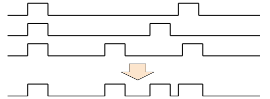

# SoundTest 3重和音 減衰付き / Triple chord with attenuation

* 8253 のモード切替を使って, CPU が自ら音声出力を直接 H/L に切り替えて 3 和音を合成しながら出力します: 

* 精度 10 kHz を保つなら, 三重和音あたりが限界になります
* 減衰音は凸部を小さくすることで実現しています. 凸部が小さくなると次第に高周波成分が増えていきます
