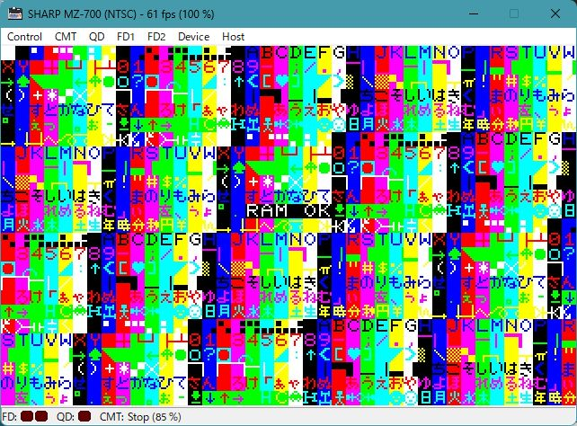

# RAM チェック / RAM check

* MZ-700 の プログラム以外の全 RAM (VRAM を含む) をテストします 
  プログラム自身はチェックサムを計算します
* アルゴリズム:
  * 全 RAM に渡って 0x01,0x02,...,0xff をアドレス昇順に書いてチェック
  * アドレス降順に書いてチェック
  * ビット反転した値でアドレス昇順に書いてチェック
  * アドレス降順に書いてチェック
* メモリそのもの異常の他, アドレスバス, データバスの異常 (配線のショートや切断) も検出できると思います 
  しかし, アドレスバスが異常の場合は, おそらくチェック中にプログラムを書き換えてしまい, 暴走してしまうでしょう. データバスの異常なら, プログラムそのものがRAMから正しく読めないので即暴走してしまうでしょう...
* 結果表示とコード部分以外の RAM は使用してません (スタックや変数はありません)
* コード自身は, 自己書換してません
* テスト時間は, 約10秒
  * プログラム自身のチェックサムに失敗すると 「CHECK SUM ERROR」 を次行に表示して HALT します
  * 正常なら 「RAM OK」 を画面中央に表示して HALT します (画像参照)
  * 異常なら 「RAM BAD *アドレス*」 を画面中央に表示して HALT します
* システムが不安定の場合, チェック中に暴走して結果を表示しない場合があります
* このテストを通っても, システムが正常とは限りません. 参考程度にお使いください
* 経験的に, パソコンは大抵電源から故障します