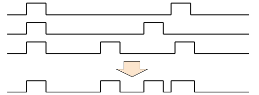

# SoundTest1: 3音源 減衰付き / 3 sound sources with attenuation

* 8253 のモード切替を使って, CPU が自ら音声出力を直接 H/L に切り替えて 3 和音を OR 合成しながら出力します: 

* 精度 10 kHz を保つなら, 三重和音あたりが限界になります
* 合成前の波形は, デューティ比50%が理想ですが, 減衰音をサポートするために, 周波数にかかわらず, '1' の時間は固定値になってます
* 減衰音は凸部を小さくすることで実現しています. 凸部が小さくなると次第に高周波成分が増えていきます
* 終了したらモニター ROM に戻ります (たぶん) 
  実行アドレスは, 0x1200. 再実行できます
