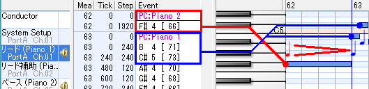
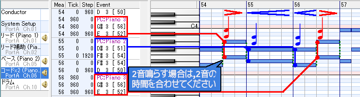
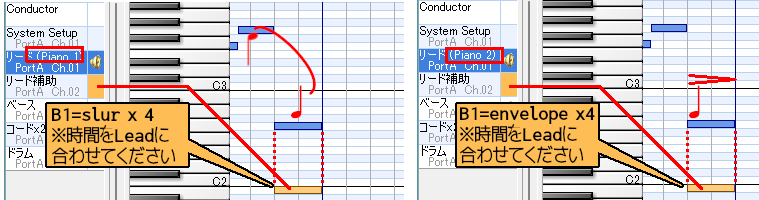
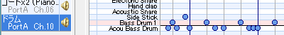
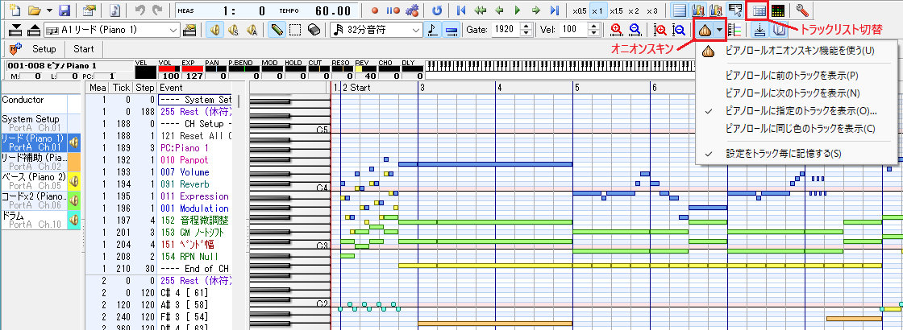

# MIDI → sd6 / sd4 形式データ変換ツール sd6-midi-conv / sd4-midi-conv
- sd6 形式と sd4 形式は元データは共通してるので, 違うところは [sd6], [sd4] とマークを入れます
- 個人使用のツールなので, バグが沢山あります

目次:
- [MIDI → sd6 / sd4 形式データ変換ツール sd6-midi-conv / sd4-midi-conv](#midi--sd6--sd4-形式データ変換ツール-sd6-midi-conv--sd4-midi-conv)
- [コンバータの使い方](#コンバータの使い方)
  - [入力 MIDI ファイル](#入力-midi-ファイル)
  - [コマンドライン オプション](#コマンドライン-オプション)
      - [使用例](#使用例)
      - [出力Cヘッダファイルと変数名](#出力cヘッダファイルと変数名)
      - [小節分割](#小節分割)
      - [出力例](#出力例)
- [MIDI データの作成](#midi-データの作成)
  - [チャンネルとトラックの関係 \[sd6\]](#チャンネルとトラックの関係-sd6)
  - [チャンネルとトラックの関係 \[sd4\]](#チャンネルとトラックの関係-sd4)
  - [全チャンネル共通の制限](#全チャンネル共通の制限)
  - [Lead, Base, Chord](#lead-base-chord)
  - [LeadSub](#leadsub)
  - [Drum](#drum)
- [\[Appendix A\] DOMINO での便利な使い方](#appendix-a-domino-での便利な使い方)
  - [一般設定:](#一般設定)
  - [トラック関連の設定:](#トラック関連の設定)
  - [オニオンスキンの設定:](#オニオンスキンの設定)
  - [楽曲の編集](#楽曲の編集)
- [\[Appendix B\] \[SD6\] データ フォーマット](#appendix-b-sd6-データ-フォーマット)
  - [スペック \[SD6\]](#スペック-sd6)
  - [音譜データ (凡例) \[SD6\]](#音譜データ-凡例-sd6)
  - [音符データ (Lead) \[SD6\]](#音符データ-lead-sd6)
  - [音符データ (Chord x 2) \[SD6\]](#音符データ-chord-x-2-sd6)
  - [音符データ (Base) \[SD6\]](#音符データ-base-sd6)
  - [音符データ (Drum) \[SD6\]](#音符データ-drum-sd6)
- [\[Appendix C\] \[SD4\] データ フォーマット](#appendix-c-sd4-データ-フォーマット)
  - [スペック \[SD4\]](#スペック-sd4)
  - [音譜データ (凡例) \[SD4\]](#音譜データ-凡例-sd4)
  - [音符データ (Lead) \[SD4\]](#音符データ-lead-sd4)
  - [音符データ (Chord x 2) \[SD4\]](#音符データ-chord-x-2-sd4)
  - [音符データ (Base) \[SD4\]](#音符データ-base-sd4)
  - [音符データ (Drum) \[SD4\]](#音符データ-drum-sd4)
- [\[Appendix D\] Drum 音色の作成](#appendix-d-drum-音色の作成)
  - [\[SD6\]](#sd6)
  - [\[SD4\]](#sd4)

# コンバータの使い方

```
sd6-midi-conv.php 入力MIDIファイル名 出力Cヘッダファイル名 [コマンドラインオプション...]
```

## 入力 MIDI ファイル
- MIDI FORMAT 1 のみ対応
- 同じ midi データから SD6/SD4 形式へのそれぞれの変換が可能です.
  ただし, エンベロープ速度が異なるので再調整が必要です
- 入力ファイル名については, [小節分割](#小節分割) も参照してください

## コマンドライン オプション
- sd6 / sd4 共同じオプションですので sd6 のほうで説明します
- うっかり更新しそこなうこともあるので, 最新情報は, コマンドラインのヘルプを参照してください

 | オプション           | 説明 |
 |----------------------|------|
 | -h --help            | ヘルプ                           |
 | -v --verbose         | 変換中の詳細情報を標準出力します |
 | --channels=範囲      | 指定範囲※のチャンネル [1, 16] のみ変換します(省略時:all つまりch=1,2,5,6,10) |
 | --bars=範囲          | 指定範囲※の小節 [2, 1000] のみ変換します(省略時:all, つまり2小節目以降全部)   |
 | --exceptLengths=範囲 | 指定範囲※の音長から連続する7つの音長さ (4の倍数, [4, 256]) を<span style="color: red;">特別な命令</span>に利用します<br>(default:180#24, つまり180,184,188,192,196,209,224)<br>変更したら,SD6ルーチンも変更が必要です |
 | --debugScoreDump     | 楽譜データを標準出力します |

 ※範囲指定は [0-9,-#]の他, 文字列「all」,「none」 が使えます. 指定の重複OK. 範囲はみ出しは無視します<br>
 <span style="color: red;">指定範囲は連続してなければなりません</span><br>
  **例:**「-2,3,4#2,6-2000」ならば「2,3,4,5,6,...,1000」を意味します

#### 使用例
```
php sd6-midi-conv.php music.mid music.h --ch=1,2
php sd6-midi-conv.php music.mid music.h --bars=55-60 --ch=0
php sd6-midi-conv.php music.mid music.h --exceptLengths=200#20
```

#### 出力Cヘッダファイルと変数名
- 全トラックのデータが一本のデータにまとまってます<br>
  SD3 のように各トラック別のデータになってません
- 変数名は, 出力Cヘッダファイル名(拡張子除く)を元に作られます. ハイフン「-」は, アンダースコア「_」に変換されます

#### 小節分割
- 入力MIDIファイル名(拡張子除く)の末尾が「-bar*X*x*Y*」(*X*, *Y* は10進整数) の場合, *X* 小節単位で分割した連番ファイルを出力します (*Y* は本コンバータでは使用しません. make-depend ツールが使います)
- --bars オプションで抽出した小節に対して分割を行います
- 出力Cヘッダファイル名(拡張子除く)の最後は「-0」「-1」... 等の連番が付きます
- 連番が付かないオリジナルのダミーCヘッダファイルも出力します
- 例えば,「foo-bar10x3.mid」ならば, 10 小節単位に分割し, 次のファイルを出力します:
```
  foo-bar10x3.h    ... ダミーCヘッダファイル (make の依存関係の為にで使用します）
  foo-bar10x3-0.h  ... 変数名 foo_bar10x3_0
  foo-bar10x3-1.h  ... 変数名 foo_bar10x3_1
  :
```

#### 出力例
```
//  Lead                    Base                    Chord0/1                          Drum
static u8 const sd6_chronos[] = {
    // -------- 小節2(t=0)
    SD6_L_FL(8, SD6_CS4),   SD6_B_FL(8, SD6_AS3),   SD6_C2_FL(24, SD6_CS3, SD6_AS2),  SD6_D_1(16),
    SD6_L_FL(8, SD6_AS3),   SD6_B_FL(8, SD6_FS3),
    SD6_L_FL(8, SD6_FS3),   SD6_B_FL(8, SD6_DS3),                                     SD6_D_2(8),
    SD6_L_FL(8, SD6_DS4),   SD6_B_FL(8, SD6_C4),    SD6_C2_FL(24, SD6_DS3, SD6_C3),   SD6_D_1(16),
    SD6_L_FL(8, SD6_C4),    SD6_B_FL(8, SD6_GS3),
    SD6_L_FL(8, SD6_GS3),   SD6_B_FL(8, SD6_F3),                                      SD6_D_2(8),

    // ... 中略

};
```


# MIDI データの作成
## チャンネルとトラックの関係 [sd6]
| トラックの<br>チャンネル | 最大同時<br>発音数 | 担当<br>Beeper | 役割 |
|--------|----|------------|-----|
| ch1    | 1  | Beeper0 - Beeper1<br>※Beeper1は Beeper0 より少し遅れて発声し, エコー効果を出します | Lead (リード) |
| ch2    | 1  |                  | LeadSub (リード補助) |
| ch3 - 4|    |                  | 使いません   |
| ch5    | 1  | Beeper2          | Base (ベース) |
| ch6    | 2  | Beeper3 - Beeper4| Chord (コード) |
| ch7 - 9|    |                  | 使いません   |
| ch10   | 1  | Beeper5          | Drum (ドラム) |

## チャンネルとトラックの関係 [sd4]
| トラックの<br>チャンネル | 最大同時<br>発音数 | 担当<br>Beeper | 役割 |
|--------|----|------------|-----|
| ch1    | 1  | Beeper0    | Lead (リード) |
| ch2    | 1  |            | LeadSub (リード補助) |
| ch3 - 4|    |            | 使いません   |
| ch5    | 1  | Beeper1    | Base (ベース) |
| ch6    | 2  | Beeper2    | Chord (コード)<br>2音の場合は, アルペジオします |
| ch7 - 9|    |            | 使いません   |
| ch10   | 1  | Beeper3    | Drum (ドラム) |

## 全チャンネル共通の制限
- **基本, 設定するのは音階,音色,音長だけです**
- **テンポ:** <span style="color: red;">MIDI データでは調整できません</span>. 再生ルーチンは, 約 ♩=110 で再生します. SD6PLAY() または SD4PLAY() の引数 tempo で 100～200% の速度調整ができます. sound.h を参照してください
- **音長:** 32分音符単位で, 最大全音符 x 2 です. <br>
    Lead は, <span style="color: red;">特別な命令に割り当てられる音長があり, この音長の音符は使えません</span>.
    --exceptLengths オプションを参照してください
- **その他イベント**: ノード, コントロール以外の殆どのイベントは解析しません (スキップします)
- 音符の切替に時間がかかってるので, 短い音符をやたら連打すると再生速度がもたれます。。。

## Lead, Base, Chord
- **音色** (プログラム チェンジ, PC) でエンベロープを選択します
- Chord は 1音でも2音でも使用できますが, <span style="color: red;">2音の場合, 2つの音符は同じ時間で鳴らしてください (一致しない場合はコンバート時にエラー)</span>

| 要素 | 説明 |
|------|------|
| 音階 | R, B1 - C6<br>絶対音階ではありません (A4 == 440Hz ではありません)<br>・C5 以降の高音は精度が落ちるので実用は3オクターブ程度です |
| 音色 | Piano1 = エンベロープ■<br>Piano2 = エンベロープ◣<br>Piano3 = エンベロープ◢ |
- Lead の例 (Base もだいたい同じ)

  
- Chord の例

  


## LeadSub
- **音階** で, リードのエンベロープ速度, スラー速度/タイを制御します. エンベロープ指定かスラー/タイ指定かのどちらかになります
- 休符以外で指定する場合は, <span style="color: red;">Leadと同じ時間で指定してください</span> (一致しない場合はコンバート時にエラー)

| Lead のエンベロープ (音色) | LeadSub の音階 ※LeadSubの音色はPiano1のみです |
|----------------------------|------------------------------------------------|
| ■ (Piano1)                | **スラー時のスライド速度**を指定します<br>**R:** スラー無し, タイ無し<br>**A1:** スラーあり (スライド速度x1) / タイあり<br>**A#1:** スラーあり (スライド速度x2) / タイあり <br>**B1:** スラーあり (スライド速度x4) / タイあり |
| ◣ (Piano2)<br>または<br>◢ (Piano3)<br> | **エンベロープ速度**を指定します<br>**R:** 前回と同じ速度<br>**A1:** 低速<br>**A#1:** x2<br>**B1:** x4 |
- LeadSub の例

  

## Drum
- 3 種類のドラムは (プログラムチェンジ) で指定します:

| Drum の音色        | 説明   |
|--------------------|--------|
| Acoustic Bass Drum | ドラム1|
| Bass Drum 1        | ドラム2|
| Acoustic Snare     | ドラム3|

- Drum の例

  


# [Appendix A] DOMINO での便利な使い方

## 一般設定:
  - 出力音源の設定: [<span style="color: lime;">ファイル</span>] → [<span style="color: lime;">環境設定</span>] → [<span style="color: lime;">MIDI-OUT</span>] はとりあえずポートAに, <br>デバイス=<span style="color: lime;">Microsoft GS Wavelength Synth</span><br>音源=<span style="color: lime;">GSm(Microsoft GS Wavelength SW Synth</span>)
  - ♩=80～100
  - 1小節目は「セットアップ小節」で, 音色その他の初期設定に用います.<br>
    演奏データは2小節目から入力してください
## トラック関連の設定:
  - [<span style="color: lime;">表示</span>] → [<span style="color: lime;">トラックセレクトペイン</span>] でトラックセレクトペインを表示して, トラックの設定はこれをメインで行います
  - トラックの追加・削除は, 各トラックを右クリックして [<span style="color: lime;">トラックの追加</span>], [<span style="color: lime;">トラックの削除</span>]
  - トラック名, トラックに割り当てるチャンネル番号, メロディ/ドラムの種類設定は, 各トラックを右クリックして [<span style="color: lime;">トラックのプロパティ</span>]
## オニオンスキンの設定:
  - オニオンスキンは, 複数のトラックの音符を透過的に表示できる機能です
  - オニオン色(トラックの色) は, 各トラックを右クリックして [<span style="color: lime;">オニオンスキンの色</span>]
  - トラックを選び,  [<span style="color: lime;">オニオンスキン</span>アイコン] → [<span style="color: lime;">ピアノロールに指定のトラックを表示</span>] で好きなトラックを表示できます
## 楽曲の編集
  - 音色の変更は [<span style="color: lime;">挿入</span>] → [<span style="color: lime;">プログラム チェンジ</span>]
  - 音符の移動はコピペで
  - 全トラックをまとめて小節単位でコピペするには, [<span style="color: lime;">トラックリストの切り替え</span>アイコン] (Tab) で表示を切り替えます
  - 曲の終了後に謎の無音が続く場合は, [<span style="color: lime;">イベント</span>] → [<span style="color: lime;">END OF TRACK</span>] を入れて曲を終了させます


# [Appendix B] [SD6] データ フォーマット
## スペック [SD6]
-  最も内側の Beeper ループの周期は, 大半が最短 252 T-states
- サンプリング周波数:    3579545 / 246 = 14551.0 Hz
- 1分間の四分音符の数♩: 60 * (3579545 / 246) / (256 * 32) = 106.3 (テンポは倍くらいまでいける)

## 音譜データ (凡例) [SD6]
- len 音長 ... 値[1, 2, ...  63, 0] → 内部[4, 8, ... 252, 256音長]<br>
  **例:** 32分音符 = 1, 四分音符 = 8, 全音符 = 32, 全音符 x 2 = 0
- wl  波長 ... 値[1, 2, ... 255, 0] → 内部[1, 2, ... 255, 256波長]

## 音符データ (Lead) [SD6]
- 一般
```
                    +-+-+-+-+-+-+-+-+
   休符             |0 0|    len    |
                    +-+-+-+-+-+-+-+-+
                    +-+-+-+-+-+-+-+-+  +-+-+-+-+-+-+-+-+
   ■               |1 1|    len    |  |       wl      |
                    +-+-+-+-+-+-+-+-+  +-+-+-+-+-+-+-+-+
                    +-+-+-+-+-+-+-+-+  +-+-+-+-+-+-+-+-+
   ◢               |0 1|    len    |  |       wl      |
                    +-+-+-+-+-+-+-+-+  +-+-+-+-+-+-+-+-+
                    +-+-+-+-+-+-+-+-+  +-+-+-+-+-+-+-+-+
    ◣              |1 0|    len    |  |       wl      |
                    +-+-+-+-+-+-+-+-+  +-+-+-+-+-+-+-+-+
```
- Lead の特定の音長 (ここでは e で示されます) は<span style="color: red;">特別な命令</span>に割り当てられます.
  --exceptLengths オプションで設定を変更できます(e が 45 ならば, 45#6 が特定の命令なので, オプションでは, 180#24 を指定します)
```
                   +-+-+-+-+-+-+-+-+
   リピート        |0 0|  [e, e+6] |  2～7回,5ネスト迄
                   +-+-+-+-+-+-+-+-+
                   +-+-+-+-+-+-+-+-+
   リピート終了    |0 1|     e     |
                   +-+-+-+-+-+-+-+-+
                   +-+-+-+-+-+-+-+-+
   終了            |0 1|     e+1   |
                   +-+-+-+-+-+-+-+-+
                   +-+-+-+-+-+-+-+-+  ◢◣用
   エンベロープ速度|1 0|  [e, e+3] |  e / e+1 / e+2 / e+3 = 1/2, 1/4, 1/8(デフォルト), 1/16
                   +-+-+-+-+-+-+-+-+
                   +-+-+-+-+-+-+-+-+  ■用. スライド時は, 波長カウンタのリセットや音量の再設定はしません
   スライド速度    |1 1|  [e , e+3] |  e / e+1 / e+2 = スライド無(デフォルト), 1/1, 1/2, 1/3
                   +-+-+-+-+-+-+-+-+
```
## 音符データ (Chord x 2) [SD6]
```
          +-+-+-+-+-+-+-+-+
   休符   |0 0|    len    |
          +-+-+-+-+-+-+-+-+
          +-+-+-+-+-+-+-+-+  +-+-+-+-+-+-+-+-+  +-+-+-+-+-+-+-+-+
   ◢     |0 1|    len    |  |       wl0     |  |       wl1     |
          +-+-+-+-+-+-+-+-+  +-+-+-+-+-+-+-+-+  +-+-+-+-+-+-+-+-+
          +-+-+-+-+-+-+-+-+  +-+-+-+-+-+-+-+-+  +-+-+-+-+-+-+-+-+
   ◣     |1 0|    len    |  |       wl0     |  |       wl1     |
          +-+-+-+-+-+-+-+-+  +-+-+-+-+-+-+-+-+  +-+-+-+-+-+-+-+-+
          +-+-+-+-+-+-+-+-+  +-+-+-+-+-+-+-+-+  +-+-+-+-+-+-+-+-+
   ■     |1 1|    len    |  |       wl0     |  |       wl1     |
          +-+-+-+-+-+-+-+-+  +-+-+-+-+-+-+-+-+  +-+-+-+-+-+-+-+-+
```
## 音符データ (Base) [SD6]
```
          +-+-+-+-+-+-+-+-+
   休符   |0 0|    len    |
          +-+-+-+-+-+-+-+-+
          +-+-+-+-+-+-+-+-+  +-+-+-+-+-+-+-+-+
   ◢     |0 1|    len    |  |       wl      |
          +-+-+-+-+-+-+-+-+  +-+-+-+-+-+-+-+-+
          +-+-+-+-+-+-+-+-+  +-+-+-+-+-+-+-+-+
   ◣     |1 0|    len    |  |       wl      |
          +-+-+-+-+-+-+-+-+  +-+-+-+-+-+-+-+-+
          +-+-+-+-+-+-+-+-+  +-+-+-+-+-+-+-+-+
   ■     |1 1|    len    |  |       wl      |
          +-+-+-+-+-+-+-+-+  +-+-+-+-+-+-+-+-+
```
## 音符データ (Drum) [SD6]
```
                 +-+-+-+-+-+-+-+-+
   休符/ドラム   |   len     |d d|      d ... ドラム番号[1～3]. 0 は休符
                 +-+-+-+-+-+-+-+-+
```


# [Appendix C] [SD4] データ フォーマット
## スペック [SD4]
- 最も内側の Beeper ループの周期は, 大半が最短 15699Hz (VSync と同じ)
- 1分間の四分音符の数♩: 15699 * 60 / (256 * 8 * 4) = 117.2 (テンポは倍くらいまでいける)

## 音譜データ (凡例) [SD4]
- len 音長 ... [1, 2, ...  63, 0] → [4, 8, ... 252, 256音長]
  8を指定すると四分音符, 32を指定すると全音符
- wl  波長 ... [1, 2, ... 255, 0] → [1, 2, ... 255, 256波長]

## 音符データ (Lead) [SD4]
```
   - 一般
                      +-+-+-+-+-+-+-+-+
     休符             |0 0|    len    |
                      +-+-+-+-+-+-+-+-+
                      +-+-+-+-+-+-+-+-+  +-+-+-+-+-+-+-+-+
     ■               |1 1|    len    |  |       wl      |
                      +-+-+-+-+-+-+-+-+  +-+-+-+-+-+-+-+-+
                      +-+-+-+-+-+-+-+-+  +-+-+-+-+-+-+-+-+
     ◢               |0 1|    len    |  |       wl      |
                      +-+-+-+-+-+-+-+-+  +-+-+-+-+-+-+-+-+
                      +-+-+-+-+-+-+-+-+  +-+-+-+-+-+-+-+-+
     ◣               |1 0|    len    |  |       wl      |
                      +-+-+-+-+-+-+-+-+  +-+-+-+-+-+-+-+-+
```
  - Lead の特定の音長は命令になります. 音長値は, SD6_EXCEPT_LEN#SD6_EXCEPT_LEN_SZ で定義
```
                      +-+-+-+-+-+-+-+-+
     リピート         |0 0|  [e, e+6] |  2～7回,5ネスト迄
                      +-+-+-+-+-+-+-+-+
                      +-+-+-+-+-+-+-+-+
     リピート終了     |0 1|     e     |
                      +-+-+-+-+-+-+-+-+
                      +-+-+-+-+-+-+-+-+
     終了             |0 1|     e+1   |
                      +-+-+-+-+-+-+-+-+
                      +-+-+-+-+-+-+-+-+  ◢◣用
     エンベロープ速度 |1 0|  [e, e+3] |  e/e+1/e+2/e+3 = 1/2, 1/4, 1/8(デフォルト), 1/16
                      +-+-+-+-+-+-+-+-+
                      +-+-+-+-+-+-+-+-+  ■用. スライド時は, 波長カウンタのリセットや音量の再はしません
     スライド速度     |1 1|  [e, e+3] |  e/e+1/e+2 = スライド無(デフォルト), 1/1, 1/2, 1/3
                      +-+-+-+-+-+-+-+-+

```
## 音符データ (Chord x 2) [SD4]
```
          +-+-+-+-+-+-+-+-+
   休符   |0 0|    len    |
          +-+-+-+-+-+-+-+-+
          +-+-+-+-+-+-+-+-+  +-+-+-+-+-+-+-+-+  +-+-+-+-+-+-+-+-+
   ◢     |0 1|    len    |  |       wl0     |  |       wl1     |
          +-+-+-+-+-+-+-+-+  +-+-+-+-+-+-+-+-+  +-+-+-+-+-+-+-+-+
          +-+-+-+-+-+-+-+-+  +-+-+-+-+-+-+-+-+  +-+-+-+-+-+-+-+-+
   ◣     |1 0|    len    |  |       wl0     |  |       wl1     |
          +-+-+-+-+-+-+-+-+  +-+-+-+-+-+-+-+-+  +-+-+-+-+-+-+-+-+
          +-+-+-+-+-+-+-+-+  +-+-+-+-+-+-+-+-+  +-+-+-+-+-+-+-+-+
   ■     |1 1|    len    |  |       wl0     |  |       wl1     |
          +-+-+-+-+-+-+-+-+  +-+-+-+-+-+-+-+-+  +-+-+-+-+-+-+-+-+
```
## 音符データ (Base) [SD4]
```
          +-+-+-+-+-+-+-+-+
   休符   |0 0|    len    |
          +-+-+-+-+-+-+-+-+
          +-+-+-+-+-+-+-+-+  +-+-+-+-+-+-+-+-+
   ◢     |0 1|    len    |  |       wl      |
          +-+-+-+-+-+-+-+-+  +-+-+-+-+-+-+-+-+
          +-+-+-+-+-+-+-+-+  +-+-+-+-+-+-+-+-+
   ◣     |1 0|    len    |  |       wl      |
          +-+-+-+-+-+-+-+-+  +-+-+-+-+-+-+-+-+
          +-+-+-+-+-+-+-+-+  +-+-+-+-+-+-+-+-+
   ■     |1 1|    len    |  |       wl      |
          +-+-+-+-+-+-+-+-+  +-+-+-+-+-+-+-+-+
```
## 音符データ (Drum) [SD4]
```
                  +-+-+-+-+-+-+-+-+
   休符/ドラム    |   len     |d d|      d ... ドラム番号[1～3]. 0 は休符
                  +-+-+-+-+-+-+-+-+
```


# [Appendix D] Drum 音色の作成

## [SD6]
- テキストで作成し, sd6-gen-data.php で C ヘッダに変換してソースに組み込みます
```
  pulse.txt  drum0.txt  drum1.txt  drum2.txt
     |          |          |          |
  +--+----------+----------+----------+--+
  |          sd6-gen-data.php            |
  +------------------+-------------------+
                     |
                   out.h
```
  - pulse.txt (波長によるパルス幅の指定などのテーブル. 基本固定)
```
00 1f 03 06

//波長256 → パルス幅変換テーブル(最初のみ. あとは未使用)
//|エンベロープ速度逆数テーブル (この値と and して 0 ならば速度変更)
//| | スライド速度逆数テーブル (最初は未使用. 2番目以降は, この値と and して 0 ならば速度変更)
//| |  | 未使用
//| |  | |
0f 03 00 00
00 07 00 00
00 0f 01 00
00 1f 03 06

// 波長15～255 → パルス幅変換テーブル
06060606 06060606 06060606 06060606
07070707 07070707 07070707 07070707
08080808 08080808 08080808 08080808

09090909 09090909 09090909 09090909
0a0a0a0a 0a0a0a0a 0a0a0a0a 0a0a0a0a
0b0b0b0b 0b0b0b0b 0b0b0b0b 0b0b0b0b
0c0c0c0c 0c0c0c0c 0c0c0c0c 0c0c0c0c

0c0c0c0c 0c0c0c0c 0c0c0c0c 0c0c0c0c
0d0d0d0d 0d0d0d0d 0d0d0d0d 0d0d0d0d
0d0d0d0d 0d0d0d0d 0d0d0d0d 0d0d0d0d
0e0e0e0e 0e0e0e0e 0e0e0e0e 0e0e0e0e

0e0e0e0e 0e0e0e0e 0e0e0e0e 0e0e0e0e
0f0f0f0f 0f0f0f0f 0f0f0f0f 0f0f0f0f
0f0f0f0f 0f0f0f0f 0f0f0f0f 0f0f0f0f
0f0f0f0f 0f0f0f0f 0f0f0f0f 0f0f0f0f
```
  - drum0.txt の例
```
11111100 00000000 00000000 00000000
00001111 11000000 00000000 00000000
00000000 11111100 00000000 00000000
00000000 00001111 11000000 00000000

00000000 00000011 11110000 00000000
00000000 00000000 00111111 00000000
00000000 00000000 00000011 11110000
00000000 00000000 00000000 00111111
```
## [SD4]
- それぞれの音色を BMP/WAV/TXT のいずれかで作成し, sd4-wav-conv.php で C ヘッダに変換して, 3音分をソースに組み込みます
```
  drum0.txt/bmp/txt      drum1.txt/bmp/txt      drum2.txt/bmp/txt
           |                     |                     |
  +--------+---------+  +--------+---------+  +--------+---------+
  | sd4-wav-conv.php |  | sd4-wav-conv.php |  | sd4-wav-conv.php |
  +--------+---------+  +--------+---------+  +--------+---------+
           |                     |                     |
        drum0.h               drum1.h                drum2.h
```
- drum0.bmp の例

  